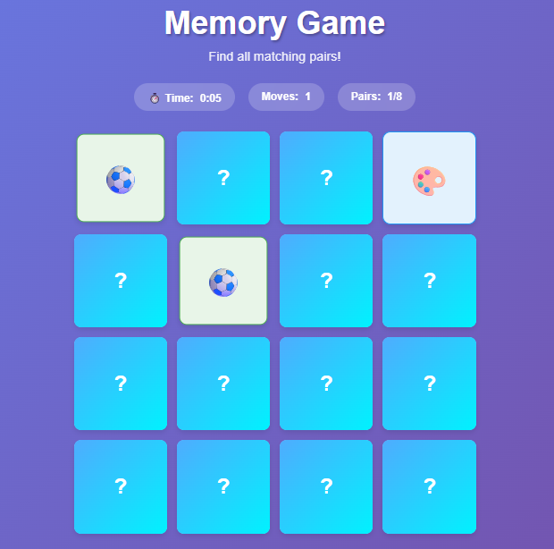

# Memory Game

A responsive React and TypeScript game: uncover eight emoji pairs, track your moves, and beat your own time.

  



The retained screenshot shows the project's original design; small control and spacing details have changed.

## Play

Select two cards with a pointer, Enter, or Space. Matching cards stay visible; unmatched cards hide after 800 milliseconds. Each second selection counts one move. The timer starts on the first valid selection and stops when all eight pairs match. **New Game** resets the deck, moves, matches, and timer, including any pending pair-resolution callback.

## Run locally

Use Node.js 22.19 or later and npm:

```sh
git clone https://github.com/shazeel-ahmed31/Memory-Game.git
cd Memory-Game
npm ci
npm run dev
```

Open http://localhost:3000. For production checks:

```sh
npm run typecheck
npm test
npm run build
npm start
```

No backend, authentication, API key, or persistent leaderboard is implemented.

## Implementation

- Next.js App Router files live in `app/`; the client game is `components/memory-game.tsx`.
- `lib/game.ts` contains immutable state transitions, deck generation, and time formatting.
- Fisher–Yates shuffling creates exactly two cards for each of eight **unique** emojis. Card IDs remain unique after shuffling.
- Functional React updates prevent stale selections; the two-card lock prevents a third selection while resolving a pair.
- Effect cleanup cancels pending pair resolution on restart/unmount and stops the timer after a win.
- Card buttons have visible keyboard focus and names that reveal symbols only after flipping. Match and win updates are announced without reading the timer every second.
- Tailwind CSS styles the interface; Lucide provides icons. Only the reachable Button/Badge helpers and their dependencies are retained from the generated component library.

## Legacy static example

The independent HTML/CSS/JavaScript version is preserved in `legacy/`. Open `legacy/index.html` or serve that directory with `python -m http.server`. It is not the primary React application. Its pending-match restart callback and keyboard card controls were also corrected. It is not served by Next.js.

## Tests and CI

Four Node test groups exercise unique pair generation, unique IDs, move counting, ignored duplicate/third selections, matching, mismatch reset, completion, immutable updates, new-game state, and time formatting. Tests import the pure TypeScript module through Node's type stripping, with process isolation disabled for compatibility with restricted Windows environments.

GitHub Actions installs the locked dependency set, checks types, runs the logic tests, and builds the application. TypeScript build errors are no longer suppressed in Next.js configuration.

## Audit validation

Dependency installation, TypeScript checks, four logic test groups, and browser keyboard/restart/mobile checks passed locally. The Next.js development server rendered the restored React application. The Windows sandbox blocked production builds with `spawn EPERM`; the Linux CI build is the authoritative production-build check.

`npm audit` reported seven remaining dependency findings (five high, two moderate), in the Tailwind 3 glob/selector dependency chain. Next.js was updated within major version 15 and its PostCSS dependency was aligned with the patched direct PostCSS version. No claim of a clean dependency audit is made. Resolving the remaining findings may require upstream fixes or a separately tested styling migration.

## Limitations and future work

The timer counts active interval ticks and may slow in background tabs; it is not a competitive wall-clock timer. Game progress is not saved. Shuffling uses `Math.random`, suitable for casual play. Emoji rendering depends on the platform. No public demo has been deployed or verified.

Potential improvements include selectable deck sizes, automated browser gameplay tests, and optional local best-score storage.

## Author and license

[Shazeel Ahmed](https://github.com/shazeel-ahmed31). No repository license file is included.
